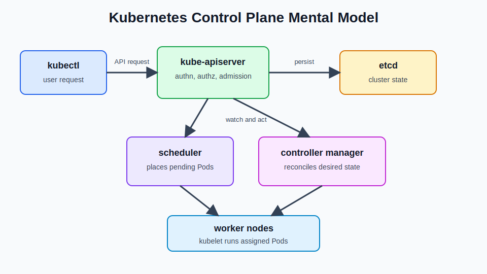
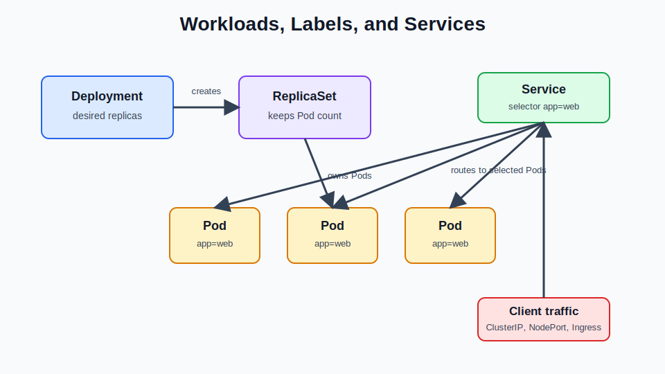
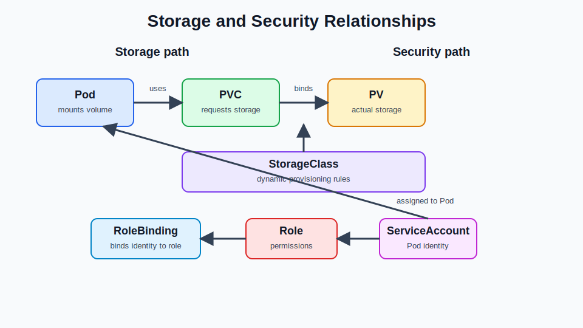

# Kubernetes Definitions Study Sheet

Use this as the theory companion to the command-focused Kubernetes quick references. The goal is to recognize the term, know what problem it solves, and remember where it shows up in CKA or CKAD tasks.

## Quick Visuals

## Kubernetes API Basics

| Term | Meaning | Study note |
| --- | --- | --- |
| API server | The front door to the Kubernetes control plane. It validates requests, handles authentication and authorization, and persists accepted state through etcd. | Know that almost every `kubectl` command talks to this component. |
| API resource | A resource type exposed by the Kubernetes API, such as Pods, Deployments, Services, or ConfigMaps. | Use `kubectl api-resources`. |
| API group | A logical API namespace such as `apps`, `batch`, `networking.k8s.io`, or the core group. | Shows up in `apiVersion`. |
| API version | The version of an API group, such as `v1`, `apps/v1`, or `batch/v1`. | CKAD includes API deprecation awareness. |
| Kind | The object type in a manifest, such as `Pod`, `Deployment`, or `Service`. | `apiVersion` plus `kind` tells Kubernetes what object you are creating. |
| Object | A persisted record of desired or observed cluster state. | Pods, Nodes, Services, and Roles are objects. |
| Manifest | A YAML or JSON file that declares Kubernetes objects. | Know how to generate one with `--dry-run=client -o yaml`. |
| Spec | The desired state section of an object. | You write this. Controllers work toward it. |
| Status | The observed state section of an object. | Kubernetes writes this. Use it for troubleshooting. |
| Metadata | Object identity and organization fields such as `name`, `namespace`, `labels`, and `annotations`. | Critical for selectors and ownership. |
| Namespace | A scope used to group namespaced resources. | Names must be unique inside a namespace, not across all namespaces. |
| Label | A key-value pair used to organize and select objects. | Services, Deployments, and NetworkPolicies depend heavily on labels. |
| Selector | A query that matches labels. | Wrong selectors are a common Service and Deployment failure. |
| Annotation | Metadata for tools, controllers, or extra information. | Not normally used for selection. |
| OwnerReference | Metadata that links dependent objects to an owner. | Enables cleanup through garbage collection. |
| Finalizer | A field that blocks object deletion until cleanup completes. | Stuck finalizers can cause stuck deletion. |

## Control Plane

| Term | Meaning | Study note |
| --- | --- | --- |
| Control plane | The components that make global cluster decisions and maintain cluster state. | CKA must know these deeply. |
| kube-apiserver | The API entrypoint for users, controllers, nodes, and automation. | Check health with `/readyz` and `/livez`. |
| etcd | The strongly consistent key-value database that stores cluster state. | CKA should know backup and restore. |
| kube-scheduler | Assigns unscheduled Pods to Nodes. | Scheduling depends on requests, taints, affinity, and constraints. |
| kube-controller-manager | Runs controller loops that watch current state, compare it to desired state, and make changes to reconcile the difference. | Examples: Deployment, ReplicaSet, Node, Job, Namespace, ServiceAccount, and EndpointSlice controllers. |
| cloud-controller-manager | Integrates Kubernetes with cloud-provider APIs. | Handles cloud load balancers, routes, and node metadata when configured. |
| Controller | A reconciliation loop that watches objects and acts to move actual state toward desired state. | Core mental model for Kubernetes. |
| Reconciliation | The process of continuously correcting actual cluster state to match desired state. | Explains why deleted Pods come back under Deployments. |
| Desired state | What the user declares in the object `spec`. | Example: Deployment `replicas: 3`. |
| Current state | What is actually running or observed by the cluster. | Visible in `status`, events, and resource listings. |
| Leader election | A mechanism that lets only one replica of a control-plane controller actively lead. | Useful for HA control planes. |
| Lease | A coordination object often used for leader election and node heartbeats. | Seen in `coordination.k8s.io`. |

## Node Components

| Term | Meaning | Study note |
| --- | --- | --- |
| Node | A worker machine that runs Pods. | Can be a VM or physical host. |
| kubelet | The node agent that ensures assigned Pods and containers are running. | Check with `systemctl status kubelet` and `journalctl -u kubelet`. |
| kube-proxy | Implements Service virtual IP behavior and load balancing on Nodes. | Usually programs iptables, IPVS, or nftables rules. |
| Container runtime | Software that runs containers, such as containerd or CRI-O. | kubelet talks to it through CRI. |
| CRI | Container Runtime Interface. | API between kubelet and the runtime. |
| Static Pod | A Pod managed directly by kubelet from a local manifest file. | kubeadm runs control-plane components as static Pods. |
| Mirror Pod | API-server representation of a static Pod. | You can view it with `kubectl`, but kubelet owns it. |
| Node condition | Node health signal such as `Ready`, `MemoryPressure`, `DiskPressure`, or `PIDPressure`. | Check with `kubectl describe node`. |
| Cordon | Marking a Node unschedulable. | Existing Pods stay running. |
| Drain | Safely evicting Pods from a Node for maintenance. | Use before node work or upgrades. |
| Uncordon | Marking a Node schedulable again. | Use after maintenance. |
| Node-pressure eviction | kubelet evicting Pods when node resources are constrained. | Know the pressure conditions. |

## Workloads and Pod Design

| Term | Meaning | Study note |
| --- | --- | --- |
| Pod | The smallest deployable unit in Kubernetes. It contains one or more containers sharing network and storage. | CKAD must be fast with Pod YAML. |
| Deployment | Manages stateless replicated Pods and rolling updates. | Creates ReplicaSets. |
| ReplicaSet | Ensures a specified number of matching Pods exist. | Usually managed by Deployments. |
| StatefulSet | Manages stateful Pods with stable identities and storage. | Know stable names and PVC behavior. |
| DaemonSet | Runs one Pod on every matching Node. | Used for agents, logging, monitoring, and CNI. |
| Job | Runs Pods until a task completes successfully. | `restartPolicy` is usually `Never` or `OnFailure`. |
| CronJob | Creates Jobs on a schedule. | Uses cron schedule syntax. |
| Init container | A container that runs to completion before app containers start. | CKAD should know ordering and shared volumes. |
| Sidecar | A helper container that runs alongside the main app container. | Common for logs, proxies, and sync tasks. |
| Ambassador pattern | A sidecar that proxies outbound access to another service. | CKAD multi-container pattern. |
| Adapter pattern | A sidecar that normalizes output or behavior for another system. | CKAD multi-container pattern. |
| Ephemeral container | A temporary debugging container added to a running Pod. | Used with `kubectl debug`. |
| Command | Overrides the image entrypoint. | In YAML this maps to container `command`. |
| Args | Arguments passed to the command or image entrypoint. | In YAML this maps to container `args`. |
| Restart policy | Defines Pod restart behavior: `Always`, `OnFailure`, or `Never`. | Deployments expect `Always`; Jobs often use `Never` or `OnFailure`. |
| ImagePullPolicy | Controls when kubelet pulls an image. | `Always`, `IfNotPresent`, or `Never`. |

## Scheduling and Resources

| Term | Meaning | Study note |
| --- | --- | --- |
| Resource request | CPU or memory reserved for scheduling. | Scheduler uses requests, not actual usage. |
| Resource limit | Maximum resource usage allowed for a container. | Memory limit breaches can cause OOMKilled. |
| QoS class | Pod quality class based on requests and limits: `Guaranteed`, `Burstable`, or `BestEffort`. | Matters during eviction. |
| Taint | A Node property that repels Pods. | Control-plane Nodes often have taints. |
| Toleration | A Pod property that allows scheduling onto a tainted Node. | Toleration does not force placement. |
| nodeSelector | Simple scheduling requirement based on Node labels. | Fastest scheduling constraint to use in exams. |
| Node affinity | Advanced rule for attracting Pods to Nodes. | More expressive than `nodeSelector`. |
| Pod affinity | Scheduling rule that attracts Pods near other Pods. | Based on labels and topology. |
| Pod anti-affinity | Scheduling rule that keeps Pods away from other Pods. | Useful for spreading replicas. |
| Topology spread constraint | Rule to spread Pods across topology domains such as zones or nodes. | Know conceptually; can appear in manifests. |
| ResourceQuota | Namespace-level limits for resource consumption or object counts. | CKA/CKAD can ask about quota effects. |
| LimitRange | Namespace-level default or min/max requests and limits. | Explains default resource settings. |
| PriorityClass | Defines scheduling and preemption priority. | Higher priority Pods can preempt lower priority Pods. |
| Preemption | Evicting lower-priority Pods to make room for higher-priority Pods. | Scheduling concept. |

## Networking and Services

| Term | Meaning | Study note |
| --- | --- | --- |
| Service | Stable virtual IP and DNS name for a set of Pods. | Uses selectors to find backend Pods. |
| ClusterIP | Internal-only Service type. | Default Service type. |
| NodePort | Exposes a Service on a port on every Node. | Useful for simple external access. |
| LoadBalancer | Exposes a Service through an external load balancer. | Common in cloud clusters. |
| ExternalName | Maps a Service name to an external DNS name. | No selector or endpoints. |
| Headless Service | Service without a cluster IP. | Uses `clusterIP: None`; common with StatefulSets. |
| EndpointSlice | Tracks backend endpoints for Services. | Replaces older Endpoints scaling model. |
| Ingress | HTTP/HTTPS routing rules to Services. | Requires an Ingress controller. |
| IngressClass | Selects which Ingress controller should handle an Ingress. | Useful when multiple controllers exist. |
| Ingress controller | The actual proxy/controller that implements Ingress rules. | Ingress alone does nothing without it. |
| NetworkPolicy | Allows selected traffic to or from Pods. | Requires a CNI plugin that enforces it. |
| Ingress traffic | Traffic entering selected Pods. | In NetworkPolicy, this is direction-specific. |
| Egress traffic | Traffic leaving selected Pods. | Default behavior changes once policies select a Pod. |
| CNI | Container Network Interface. Plugin system for Pod networking. | Calico, Cilium, Flannel are examples. |
| CoreDNS | Kubernetes DNS server. | Resolves Service names like `<svc>.<ns>.svc.cluster.local`. |
| kube-proxy | Node component that implements Service routing. | Also listed under node components because it runs on Nodes. |

## Configuration and Security

| Term | Meaning | Study note |
| --- | --- | --- |
| ConfigMap | Stores non-sensitive configuration as key-value pairs or files. | Can be consumed as env vars or volumes. |
| Secret | Stores sensitive configuration. | Base64 in manifests is encoding, not encryption. |
| ServiceAccount | Identity for Pods and in-cluster processes. | Bind permissions to it with RBAC. |
| Authentication | Verifies who the caller is. | Comes before authorization. |
| Authorization | Decides whether the caller can perform an action. | RBAC is common. |
| Admission control | Validates or mutates API requests before persistence. | Happens after authn/authz. |
| RBAC | Role-Based Access Control. | Know `Role`, `ClusterRole`, `RoleBinding`, `ClusterRoleBinding`. |
| Role | Namespaced permission set. | Grants verbs on resources in a namespace. |
| ClusterRole | Cluster-scoped permission set. | Can be used cluster-wide or bound inside a namespace. |
| RoleBinding | Binds a Role or ClusterRole to subjects in one namespace. | Common exam task. |
| ClusterRoleBinding | Binds a ClusterRole across the cluster. | Be careful: broad permissions. |
| SecurityContext | Pod or container security settings. | Includes users, groups, capabilities, and privilege settings. |
| runAsUser | Runs a container process as a specific Linux user ID. | CKAD security context topic. |
| runAsNonRoot | Requires a container to run as non-root. | Common app hardening field. |
| fsGroup | Sets filesystem group ownership for mounted volumes. | Often used with persistent storage. |
| Privileged container | Container with broad host-level privileges. | Usually avoid unless required. |
| Linux capability | Fine-grained Linux privilege added or dropped from a container. | Example: drop `ALL`, add only what is needed. |
| readOnlyRootFilesystem | Makes the container root filesystem read-only. | App may need writable volume mounts. |
| Pod Security Admission | Built-in admission controller that enforces Pod Security Standards. | Understand restricted/baseline/privileged conceptually. |

## Storage

| Term | Meaning | Study note |
| --- | --- | --- |
| Volume | Storage attached to a Pod. | Lives according to volume type. |
| emptyDir | Temporary Pod volume created when the Pod starts. | Deleted when Pod leaves the Node. |
| hostPath | Mounts a path from the Node filesystem. | Powerful but risky. |
| PersistentVolume | Cluster-level storage resource. | Often abbreviated PV. |
| PersistentVolumeClaim | A workload request for storage. | Often abbreviated PVC. |
| StorageClass | Defines dynamic provisioning behavior. | PVC can reference it. |
| Dynamic provisioning | Automatic PV creation for a PVC using a StorageClass. | Common cloud behavior. |
| CSI | Container Storage Interface. | Plugin system for storage providers. |
| Access mode | How a volume can be mounted, such as `ReadWriteOnce`, `ReadOnlyMany`, or `ReadWriteMany`. | Match PVC needs to storage support. |
| Volume mode | Whether the volume is mounted as a filesystem or block device. | `Filesystem` or `Block`. |
| Reclaim policy | What happens to a PV after PVC deletion. | `Retain` or `Delete` are common. |

## Health, Rollouts, and Maintenance

| Term | Meaning | Study note |
| --- | --- | --- |
| livenessProbe | Checks whether a container should be restarted. | Failed liveness restarts the container. |
| readinessProbe | Checks whether a Pod should receive Service traffic. | Failed readiness removes Pod from endpoints. |
| startupProbe | Gives slow-starting apps time before liveness/readiness checks apply. | Useful for legacy apps. |
| RollingUpdate | Deployment strategy that gradually replaces old Pods with new Pods. | Default Deployment strategy. |
| Recreate | Deployment strategy that stops old Pods before starting new ones. | Causes downtime. |
| maxSurge | Extra Pods allowed during a rolling update. | Deployment rolling update field. |
| maxUnavailable | Pods allowed to be unavailable during a rolling update. | Deployment rolling update field. |
| Revision | Deployment rollout version. | See with `kubectl rollout history`. |
| Rollback | Returning a Deployment to a previous revision. | Use `kubectl rollout undo`. |
| HorizontalPodAutoscaler | Scales replicas based on metrics. | Often called HPA. |
| PodDisruptionBudget | Limits voluntary disruptions to matching Pods. | Often called PDB. |
| API deprecation | Removal or replacement of older API versions. | CKAD lists this explicitly. |

## Cluster Administration

| Term | Meaning | Study note |
| --- | --- | --- |
| kubeadm | Tool for bootstrapping and managing Kubernetes clusters. | CKA cluster install and upgrade topic. |
| kubeconfig | Client config file with clusters, users, and contexts. | Usually at `~/.kube/config`. |
| Context | A kubeconfig entry combining cluster, user, and namespace. | Always check context in exams. |
| Certificate Authority | Entity that signs certificates used by Kubernetes components. | Often abbreviated CA. |
| Client certificate | Certificate used by a client or component to authenticate. | Used in kubeconfig and control-plane auth. |
| Bootstrap token | Token used to join Nodes to a kubeadm cluster. | Used with `kubeadm join`. |
| etcd snapshot | Point-in-time backup of etcd state. | CKA must know snapshot save and restore. |
| Cluster upgrade | Updating control-plane and node components. | CKA commonly tests kubeadm upgrade flow. |
| High availability | Running redundant control-plane components to avoid single points of failure. | Know the concept even if not building full HA in practice. |

## Packaging and Extensions

| Term | Meaning | Study note |
| --- | --- | --- |
| Helm | Kubernetes package manager that installs and manages charts. | CKAD includes Helm. |
| Chart | Helm package containing templates, values, metadata, and dependencies. | Render with `helm template`. |
| values.yaml | Helm configuration values used to render chart templates. | Override with `-f` or `--set`. |
| Kustomize | Kubernetes-native customization tool using bases, overlays, patches, and generators. | CKAD includes Kustomize. |
| CRD | CustomResourceDefinition. It extends the Kubernetes API with a new resource type. | CKAD includes resources that extend Kubernetes. |
| Custom resource | An object created from a CRD. | Example: cert-manager `Certificate`. |
| Operator | A controller that manages an app or platform through custom resources and reconciliation. | Combines CRDs plus controller logic. |
| Add-on | Extra cluster functionality installed on top of Kubernetes. | Examples: CNI, DNS, metrics-server, ingress controller. |
